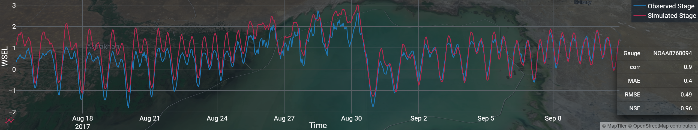

 # time-capsule

Minimal specification for timeseries data for the web, chunked into lightweight jsons. Provided as a React JS library which interprets it into Plotly plots.

The spec (so far) supports 2D overlayed line plots with 1 common X axis/coordinates, and an arbitrary number of features whose X coordinates are identical and differ only in Y coordinates. The X axis does not necessarily need to be time. The spec is modeled to closely match the plotly API (react-plotly-js and python plotly graph_object API's). 

The workflow for this paradigm will generally involve preprocessing your data model before uploading it in time-capsule format. This format is very lightweight and fast for the frontend reading the data. However, any text data format can get bulky if your data model is very large, or you need to be able to handle more complex queries or dimensional slicing. At some scale, a proper database or backend data service is better suited for your project.

An example of the spec is included as specification.json.

## TODO

React: plotting, concat etc helper functions, tc.spec object which returns specification example.
bivarate 3d plots